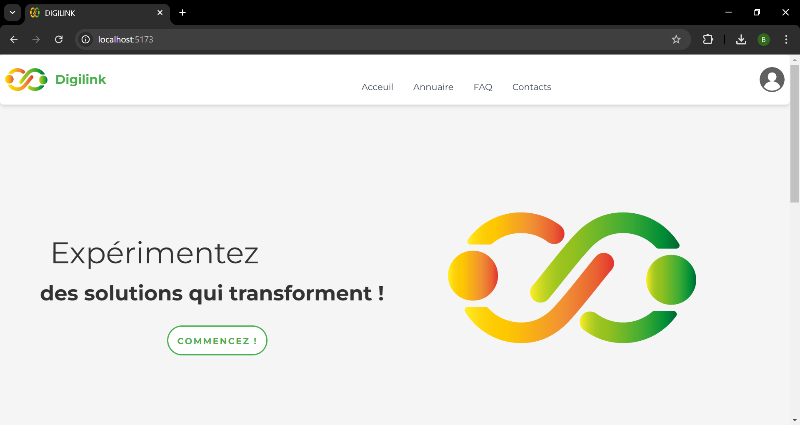
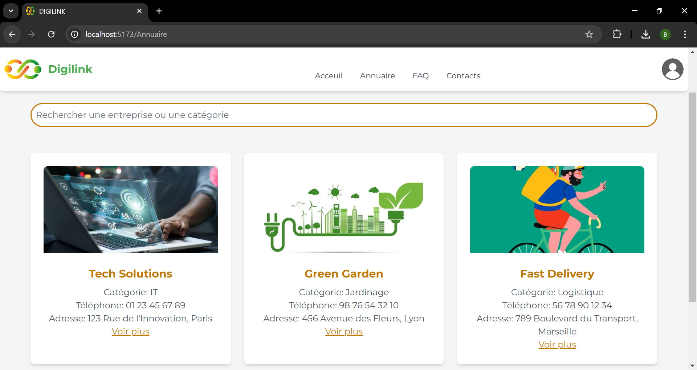
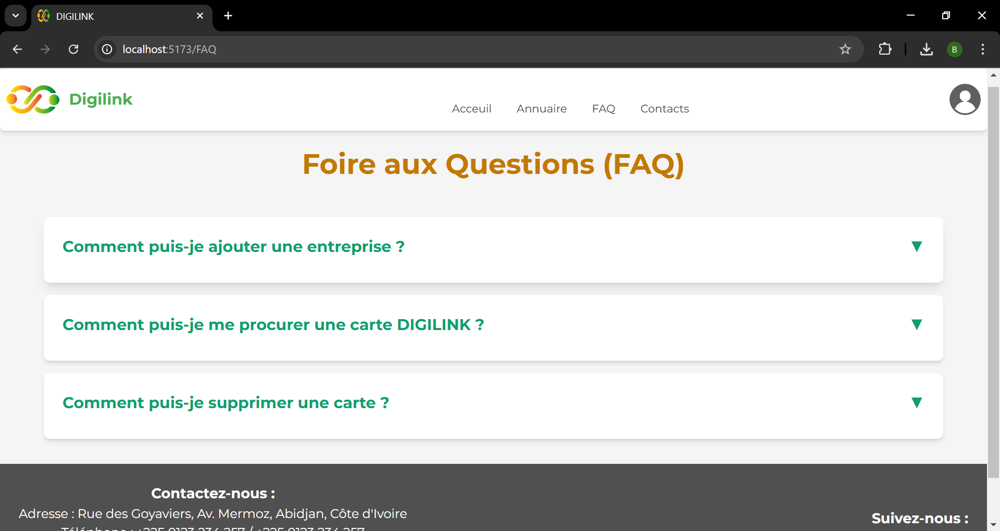
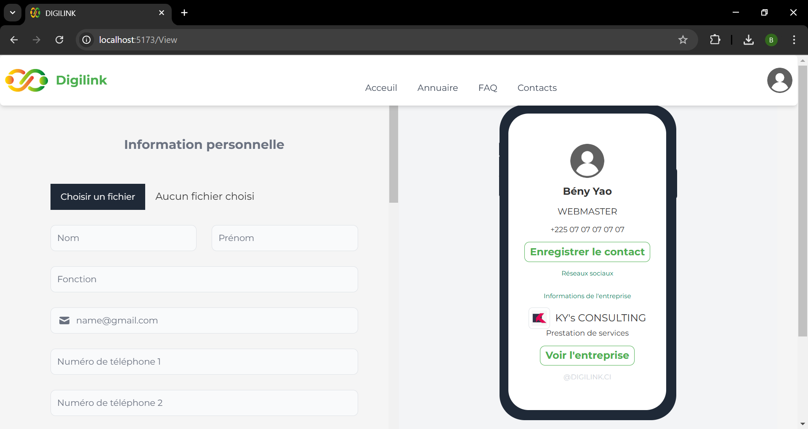
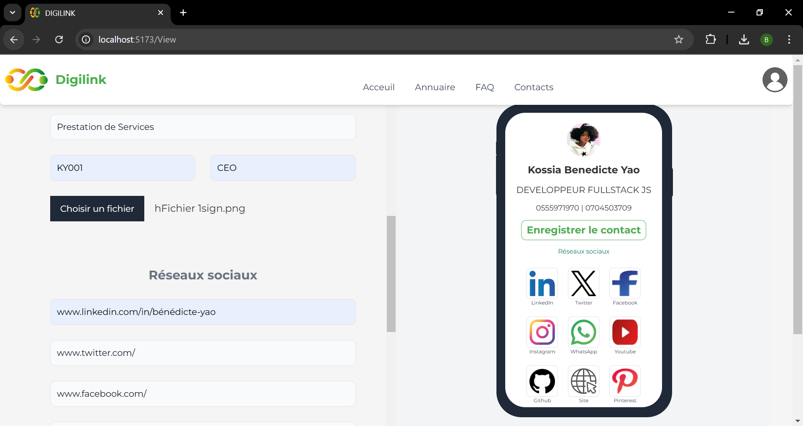
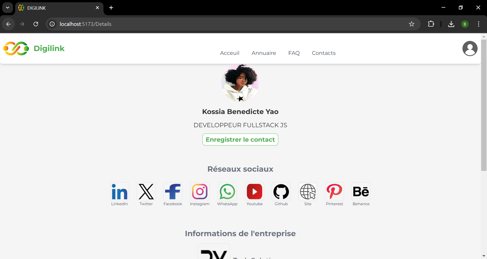
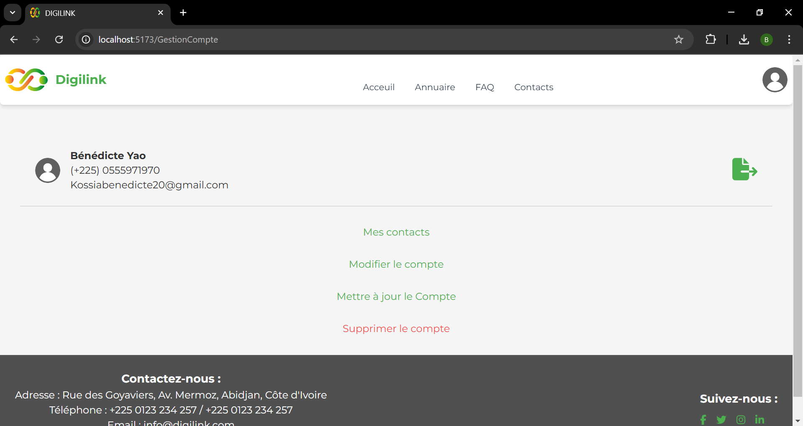
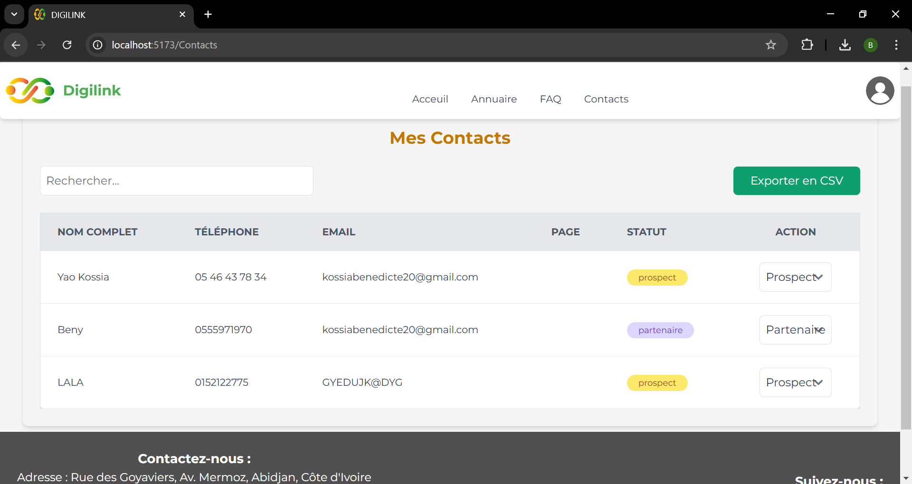

# DIGILINK

Projet de fin d'étude (Licence 3 TWIN ESATIC) 2023-2024. 

DIGILINK est une application web innovante conçue pour améliorer la gestion et le partage d'informations professionnelles et personnelles. Elle permet aux petites entreprises de créer des cartes de visite numériques, de gérer leurs contacts, et d'accéder à un annuaire complet d'entreprises.

## Table des matières

- [Fonctionnalités](#Fonctionnalités)
- [Technologies](#Technologies)
- [Installation](#Installation)
- [Contributions](#Contributions)
- [Screenshots](#Screenshots)

## Fonctionnalités

- **Création de cartes de visite numériques** : Permet aux utilisateurs de créer et de partager des cartes de visite numériques personnalisées.
- **Annuaire d'entreprises** : Un annuaire facile à naviguer pour découvrir les entreprises et leurs services.
- **Gestion des contacts** : Fonctionnalités pour ajouter, modifier et supprimer des contacts facilement.
- **Authentification sécurisée** : Accès aux fonctionnalités réservées aux utilisateurs authentifiés.
- **Intégration de la géolocalisation** : Localisation des entreprises sur une carte interactive.
- **Formulaires de contact** : Permet aux utilisateurs de contacter directement les entreprises, aussi, les entreprises peuvent contacter leurs visiteurs (propects).
- **Commande de carte DIGILINK** : Permet aux utilisateurs de commander et programmer la livraison de leurs cartes de visite Digitale avec NFC/QR Code

## Technologies

Le projet utilise les technologies suivantes :

- **Frontend** :
  - React
  - Vite
  - Tailwind CSS

- **Backend** :
  - Node.js
  - Express
  - PostgreSQL

- **Outils de développement** :
  - Git
  - Visual Studio Code
  - Postman (pour tester les API)

## Installation

Pour installer DIGILINK, suivez ces étapes :

1. Clonez le dépôt :
   ```bash
   git clone https://github.com/Cypher1305/digilink.git
   ```
   
2. Accédez au répertoire du projet :
    ```bash
    cd digilink
    ```
3. Installez les dépendances :
  Pour le frontend :
    ```bash
    cd client
    npm install
    ```
Pour le backend :
    ```bash
    cd server
    npm install
    ```
    
4. Configurez votre base de données PostgreSQL en créant une base de données et en ajoutant les informations nécessaires dans le fichier de configuration.

5. Démarrez le serveur :
    Pour le frontend :
    ```bash
    cd client
    npm run dev
    ```
    Pour le backend :
    ```bash
    cd server
    npm start
    ```
    
## Contributions
Les contributions sont les bienvenues ! Si vous souhaitez améliorer le projet, veuillez suivre les étapes suivantes :

1. Forkez le projet.
2. Créez une nouvelle branche (git checkout -b ma-nouvelle-fonctionnalité).
3. Effectuez vos modifications et ajoutez des tests si nécessaire.
4. Commitez vos modifications
     ```bash
     git commit -m 'Ajout d\'une nouvelle fonctionnalité'
     ```
5. Poussez votre branche
     ```bash
     git push origin ma-nouvelle-fonctionnalité
     ```
6. Ouvrez une Pull Request.

**Je serai ravi de recevoir vos suggestions et améliorations.🤗**

## Screenshots

Interface d'accueil de l'application 
Page Annuaire 
FAQ 
Formulaire de creation de visite numérique 
Formulaire de creation de visite numérique (rempli) 
Page d'attérissage 
Page de gestion de compte 
Page de gestion de contact 


***XoXo😘❤️❤️❤️***
